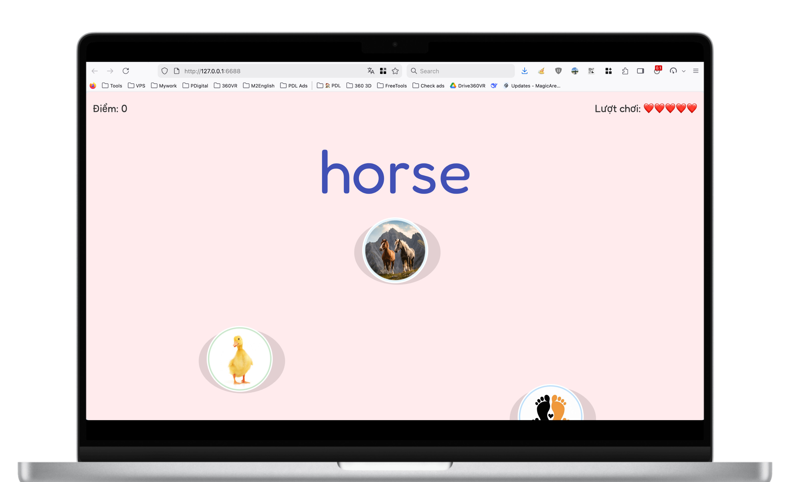

# 🎮 Bé Học Tiếng Anh

[](https://html.spec.whatwg.org/)
[](https://www.w3.org/Style/CSS/Overview.en.html)
[](https://developer.mozilla.org/en-US/docs/Web/JavaScript)
[](https://github.com/processing/p5.js)
[](https://phudigital.com)


> Game học tiếng Anh tương tác cho trẻ em với hình ảnh sinh động và phát âm chuẩn



## ✨ Tính Năng

- 🎯 **Giao diện thân thiện**: Thiết kế màu sắc tươi sáng, dễ sử dụng cho trẻ nhỏ
- 🖼️ **Học qua hình ảnh**: Mỗi từ vựng đi kèm hình ảnh minh họa sinh động
- 🔊 **Phát âm chuẩn**: Hỗ trợ Text-to-Speech cho cả tiếng Anh và tiếng Việt
- 🎨 **Hiệu ứng đẹp mắt**: Pháo hoa, particles khi trả lời đúng
- 📱 **Responsive**: Tối ưu cho cả desktop và mobile
- 🏆 **Theo dõi điểm**: Lưu kỷ lục cao nhất của bé

## 🚀 Cài Đặt & Chạy

```bash
# Clone repository
git clone <repository-url>

# Mở file index.html bằng trình duyệt
# Hoặc sử dụng Live Server
```

## 🎮 Cách Chơi

1. Nhấn nút **BẮT ĐẦU** để bắt đầu
2. Đọc từ tiếng Anh hiển thị ở trên màn hình
3. Chọn hình ảnh/nghĩa đúng trong các ô đang rơi xuống
4. Mỗi câu đúng được 10 điểm
5. Có 5 lượt chơi (❤️)
6. Cố gắng đạt điểm cao nhất!

## 📁 Cấu Trúc Dự Án

```
game-tieng-anh/
├── index.html          # File HTML chính
├── style.css           # Stylesheet
├── sketch.js           # Logic game (p5.js)
├── words.json          # Dữ liệu từ vựng
└── assets/
    ├── img/            # Hình ảnh từ vựng
    ├── ting.mp3        # Âm thanh đúng
    └── wrong.mp3       # Âm thanh sai
```

## ⚙️ Tùy Chỉnh

Chỉnh sửa các thông số trong `sketch.js`:

```javascript
const CONFIG = {
  USE_IMAGES: true, // Bật/tắt chế độ hình ảnh
  START_SPEED: 1.6, // Tốc độ rơi ban đầu
  TOTAL_LIVES: 5, // Số lượt chơi
  FIREWORKS_COUNT: 100, // Số lượng pháo hoa
  // ...
};
```

## 📝 Thêm Từ Vựng

Chỉnh sửa file `words.json`:

```json
[
  {
    "word": "Apple",
    "meaning": "Quả táo 🍎"
  },
  {
    "word": "Cat",
    "meaning": "Con mèo 🐱"
  }
]
```

Thêm hình ảnh tương ứng vào `assets/img/` với tên file trùng với từ (ví dụ: `Apple.png`, `Cat.png`)

## 🛠️ Công Nghệ Sử Dụng

- **p5.js** - Thư viện đồ họa và tương tác
- **Web Speech API** - Text-to-Speech
- **LocalStorage** - Lưu trữ điểm cao

## 📄 License

MIT License - Tự do sử dụng cho mục đích giáo dục

## 👨‍💻 Tác Giả

Phát triển bởi [Phú Digital](https://phudigital.com) - [Công Ty TNHH Giải Pháp PDL](https://pdl.vn)

---

⭐ **Nếu thấy hữu ích, hãy cho dự án một ngôi sao nhé!**
